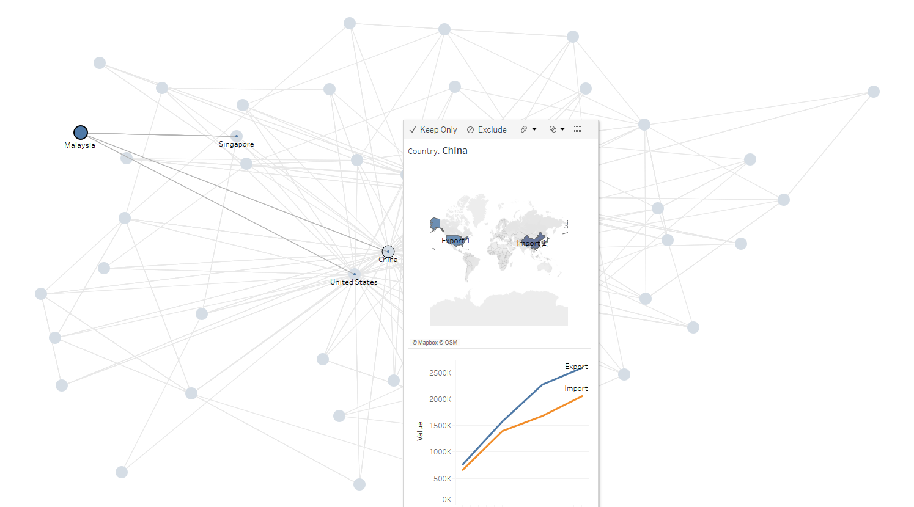

# The World Trading Network in 2020
This graph shows the relationship between the top 50 countries in terms of exportation and importation frequencies. Each node represents a single country. Interact for more information.

References: https://github.com/Lemon-Soup/NetworkChart
Data Sources: 
- http://data.un.org/_Docs/SYB/CSV/SYB64_123_202110_Total%20Imports%20Exports%20and%20Balance%20of%20Trade.csv
- http://data.un.org/_Docs/SYB/CSV/SYB64_330_202110_Major%20Trading%20Partners.csv

